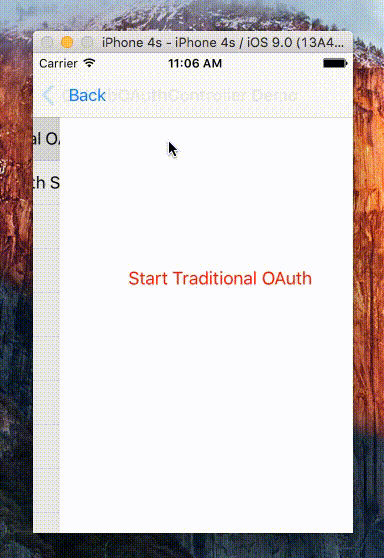

# GitHubOAuthController

Simple GitHub OAuth Controller for iOS



# Installation

## [CocoaPods](https://cocoapods.org/)

``` ruby
platform :ios, '7.0'
pod 'GitHubOAuthController'
```

## Manual

Add the files in the GitHubOAuthController folder to your project.

## Usage

``` objc
#import "GitHubOAuthController.h"

GitHubOAuthController *oAuthController = [[GitHubOAuthController alloc] initWithClientId:kClientId clientSecret:kClientSecret scope:kScope success:^(NSString *accessToken, NSDictionary *raw) {
  NSLog(@"access token: %@ \nraw: %@", accessToken, raw);
} failure:nil];
    
[oAuthController showModalFromController:self];
```

# Demo

GitHubOAuthController includes a demo project.

# Thanks

This project was inspired by Caleb Davenport's [SimpleAuth](https://github.com/calebd/SimpleAuth).

# Contact

- [github.com/dkhamsing](https://github.com/dkhamsing)
- [twitter.com/dkhamsing](https://twitter.com/dkhamsing)

# License

GitHubOAuthController is available under the MIT license. See the [LICENSE](LICENSE) file for more info.
