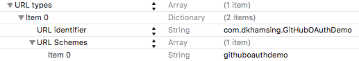

# GitHubOAuthController

Simple GitHub OAuth Controller for iOS

[](https://travis-ci.org/dkhamsing/GitHubOAuthController)
[](https://cocoapods.org/pods/GitHubOAuthController)
[](http://cocoadocs.org/docsets/GitHubOAuthController)
[](http://cocoadocs.org/docsets/GitHubOAuthController)


# Installation

## [CocoaPods](https://cocoapods.org/)

``` ruby
platform :ios, '9.0'
pod 'GitHubOAuthController'
```

## Manual

Add the files in the GitHubOAuthController folder to your project.

## Usage

### OAuth with Safari View Controller

- Set url scheme in `.plist`



```
	<key>CFBundleURLTypes</key>
	<array>
		<dict>
			<key>CFBundleURLName</key>
			<string>com.dkhamsing.GitHubOAuthDemo</string>
			<key>CFBundleURLSchemes</key>
			<array>
				<string>githuboauthdemo</string>
			</array>
		</dict>
	</array>
```
- Set *Authorization callback URL* in GitHub app https://github.com/settings/developers, i.e. `githuboauthdemo://`

``` objc
// configure (get redirectUri from plist)
[[GitHubOAuthController sharedInstance] configureForSafariViewControllerWithClientId:kClientId clientSecret:kClientSecret redirectUri:redirectUri scope:kScope];

// show login
[[GitHubOAuthController sharedInstance] presentOAuthSafariLoginFromController:self];

// get access token
- (BOOL)application:(UIApplication *)app openURL:(NSURL *)url options:(NSDictionary<NSString *,id> *)options {
    NSString *source = options[UIApplicationOpenURLOptionsSourceApplicationKey];
    if ([source isEqualToString:gh_safariViewService]) {        
        [[GitHubOAuthController sharedInstance] handleOpenUrl:url options:options success:^(NSString *accessToken, NSDictionary *raw) {
            NSLog(@"oauth with safari view controller: retrieved access token: %@ \nraw: %@", accessToken, raw);
        } failure:nil];        
    };

    return NO;
}
```

### Traditional in app OAuth

``` objc
#import "GitHubOAuthController.h"

GitHubOAuthController *oauthController = [[GitHubOAuthController alloc] initWithClientId:kClientId clientSecret:kClientSecret scope:kScope success:^(NSString *accessToken, NSDictionary *raw) {
  NSLog(@"access token: %@ \nraw: %@", accessToken, raw);
} failure:nil];

[oauthController showModalFromController:self];
```

# Demo

GitHubOAuthController includes a demo project.

# Thanks

This project was inspired by Caleb Davenport's [SimpleAuth](https://github.com/calebd/SimpleAuth).

# Contact

- [github.com/dkhamsing](https://github.com/dkhamsing)
- [twitter.com/dkhamsing](https://twitter.com/dkhamsing)

# License

GitHubOAuthController is available under the MIT license. See the [LICENSE](LICENSE) file for more info.
